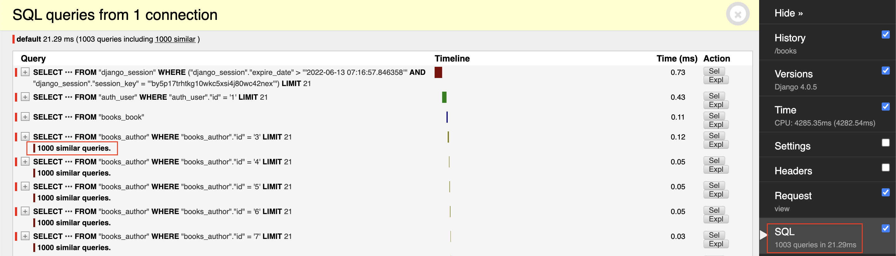
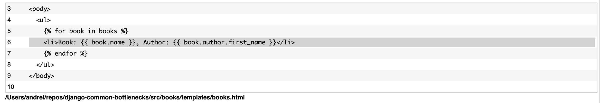
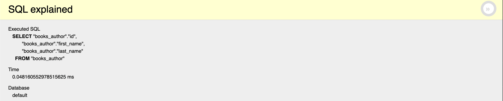
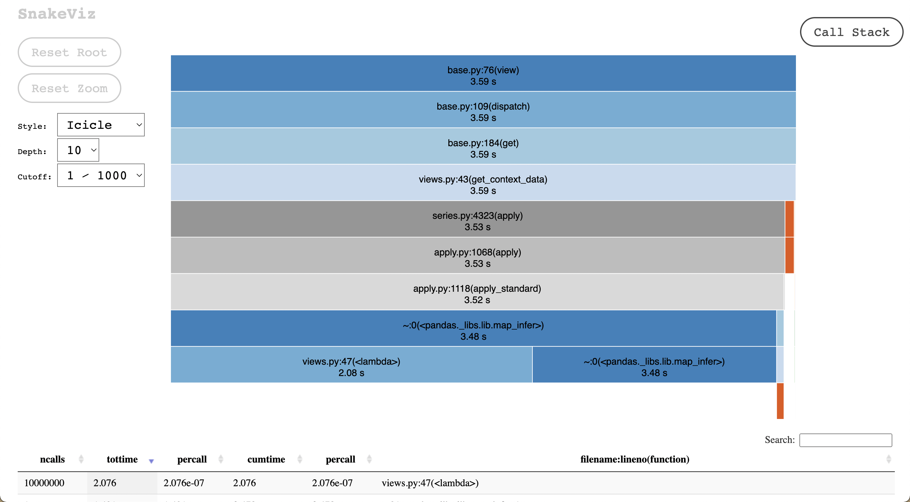
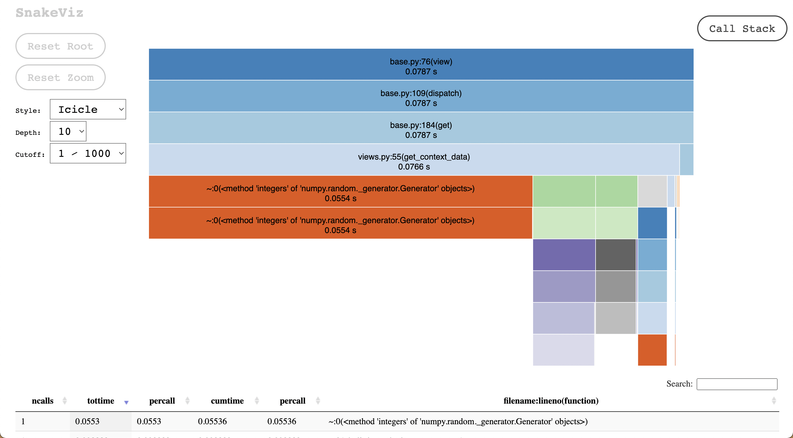

## About

This repo is just a simple playground for identifying some common Django bottlenecks.

### Info

- There are 2 models: `Book` and `Author`.
- The database already contains 1000 `books` and 1000 `authors`.
- Superadmin username: `admin`, password: `admin`.
- Profile reports can be found in `misc/prof` directory

### Tools used

- [django-debug-toolbar](https://django-debug-toolbar.readthedocs.io/en/latest/)
- [django-cprofile-middleware](https://pypi.org/project/django-cprofile-middleware/)
- [snakeviz](https://jiffyclub.github.io/snakeviz/)

### The most common bottlenecks

**1. SQL related (N+1 queries, overselecting)**

Can be easily identified using `django-debug-toolbar` SQL panel. Look at the total number of the queries along with mentions of similar queries.

If you click on `+`, you will see a stack-trace and the exact place where query was executed.

In this case the issue was caused by iterating over books and displaying author's first name for each book in the template.

Please see the examples for both `prefetch_related` and `select_related` below:

- http://localhost:8000/authors - 1003 queries, ~0.26s
- http://localhost:8000/authors-optimized (`prefetch_related`) - 4 queries, ~0.12s
- http://localhost:8000/books - 1003 queries, ~0.2s
- http://localhost:8000/books-optimized (`select_related`) - 3 queries, ~0.04s

Important note: be aware of over-selecting data that is not gonna be used, once your app is big enough and you `select_related`, `prefetch_related` many related models in a huge queryset, it might cause some unexpected high memory usage.

Use `defer()`, `only()` when necessary and check what is being selected by clicking on `Expl` (short for explain) button next to the query.

For some DB engines explain will also contain `Query Plan`, where you can quickly estimate size of returned data by multiplying `row` (amount of rows returned) by `width` (approximate size of one row in bytes).

**2. Code related**

It can be anything, from complex nested loops to calling nonoptimal methods. To detect the issues you can use `django-cprofile-middleware` in combination with `snakeviz` (profile report visualizer).

1. Download a profiler report by adding `?prof&download` to the end of URL

- http://localhost:8000/pandas?prof&download
- http://localhost:8000/pandas-optimized?prof&download

2. Visualize the report by calling `snakeviz path_to_downloaded_report`.

- `snakeviz misc/prof/pandas.prof`
- `snakeviz misc/prof/pandas-optimized.prof`

You will then see all the methods called from top to bottom, how long it took and how many times it was called.

In this example you can notice that most of the time was spent on `apply`.

If we google a bit about pandas apply we'll see that it's not the most optimal method to call, so we refactor our code a bit to make it faster and check optimized version report.

- http://localhost:8000/pandas - 3.2s
- http://localhost:8000/pandas-optimized - 0.1s
